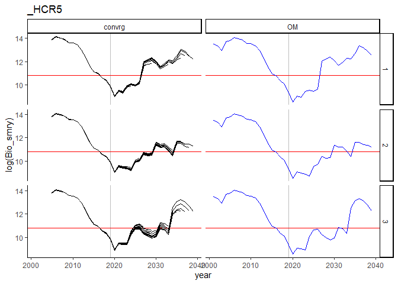
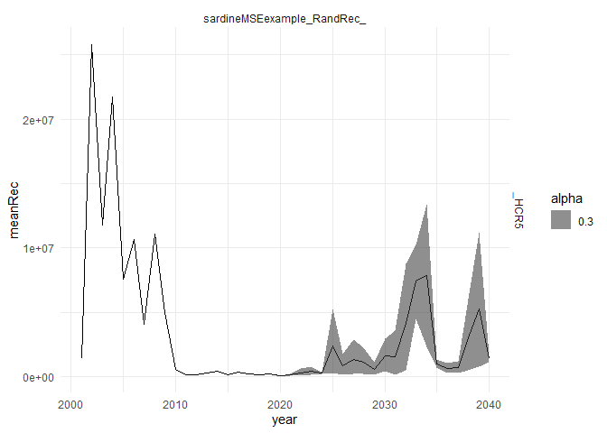

SardineMSE: Management strategy evaluation of Pacific sardine Stock
Synthesis assessment
================
Robert Wildermuth
5/10/2022

- [SardineMSE](#sardinemse)
- [An example of SardineMSE
  workflow](#an-example-of-sardinemse-workflow)
  - [Set up the sampling and operating model
    scenario](#set-up-the-sampling-and-operating-model-scenario)
  - [Calculate performance and plot
    diagnostics](#calculate-performance-and-plot-diagnostics)
- [Main Workflows](#main-workflows)
  - [Run MSE Scenarios](#run-mse-scenarios)
  - [Primary Diagnostic Summaries](#primary-diagnostic-summaries)
  - [Post-Processing and
    Visualization](#post-processing-and-visualization)
- [Additional Support Functions and
  Code](#additional-support-functions-and-code)

# SardineMSE

Management strategy evaluation of Pacific sardine Stock Synthesis
assessment

# An example of SardineMSE workflow

## Set up the sampling and operating model scenario

``` r
# directory for MSE output
# NOTE: This must be an external directory
mseOutputPath <- "C:/Users/r.wildermuth/Documents/FutureSeas/SardineScenarios"

# Operating Model - Research Model ----------------------------------------

# directory for OM SS code
# NOTE: This must be a SS model that has been run
OMmodelPath <- "scenarioModels/start2001/constGrowth"

EMmodelPath <- "scenarioModels/start2005/constantGrowth"
# EM starter.ss file must indicate init values are to be pulled from control.ss file, not ss.par

# Define Observation Model ------------------------------------------------
# Run test of marginal comps OM
datfile <- SS_readdat(file = paste0(OMmodelPath, "/data.ss"), version = "3.30")
```

    ## Running SS_readdat_3.30

    ## Read general model dimensions.

    ## Read Fleet information.

    ## Read catches.

    ## Read CPUE data.

    ## Read Length composition data.

    ## Read age composition data.

    ## Read of data file complete. Final value = 999

``` r
# define an index for the Acoustic-Trawl survey as in Desiree's code
#specify number of years of MSE loop
nyrs <- 20

#specify the start year of data inputs
yrsrt <- datfile$endyr +1

#specify the end year of data inputs
yrend <- datfile$endyr + nyrs

#sample_struct$CPUE = sample_struct$CPUE[1:nyrs,]
CPUE <- data.frame(Yr= yrsrt:yrend,
                   Seas= 1,
                   FltSvy = 4,
                   SE = 0.5)

#specify the number of catch fleets
ncdat <- 3

catch <- data.frame(Yr = rep(c(yrsrt:yrend),ncdat), 
                    Seas = c(rep(1,nyrs),rep(2,nyrs)),
                    FltSvy = c(rep(1,nyrs*2),rep(2,nyrs*2),rep(3,nyrs*2)),
                    SE = 0.05)
#specify the number of lengthcomp surveys
nldat <- 4
lencomp <- data.frame(Yr = rep(c(yrsrt:yrend),nldat), 
                     Seas = c(rep(1,nyrs),rep(4,nyrs),rep(10,nyrs),rep(4,nyrs)),
                     FltSvy = c(rep(4,nyrs),rep(1,nyrs),rep(2,nyrs),rep(3,nyrs)),
                     Sex = rep(0,nyrs*nldat),
                     Part = rep(0,nyrs*nldat),
                     Nsamp = c(rep(20,nyrs),rep(20,nyrs),rep(20,nyrs),rep(20,nyrs)))

#for age comps same surveys as as lcomps
nadat <- 4
agecomp <- data.frame(Yr = rep(c(yrsrt:yrend),nadat), 
                     Seas = c(rep(1,nyrs),rep(4,nyrs),rep(10,nyrs),rep(4,nyrs)),
                     FltSvy = c(rep(4,nyrs),rep(1,nyrs),rep(2,nyrs),rep(3,nyrs)),
                     Sex = rep(0,nyrs*nadat),
                     Part = rep(0,nyrs*nadat),
                     Ageerr = c(rep(4,nyrs),rep(4,nyrs),rep(4,nyrs),rep(4,nyrs)),
                     Lbin_lo = c(rep(-1,nyrs),rep(-1,nyrs),rep(-1,nyrs),rep(-1,nyrs)),
                     Lbin_hi = c(rep(-1,nyrs),rep(-1,nyrs),rep(-1,nyrs),rep(-1,nyrs)),
                     Nsamp = c(rep(20,nyrs),rep(20,nyrs),rep(20,nyrs),rep(20,nyrs)))

sample_struct <- list(catch = catch, CPUE = CPUE, lencomp = lencomp, agecomp = agecomp)
sample_struct_list <- list("sardineMSEexample_RandRec_HCR5" = sample_struct)

# figure out the recruitment deviation input ---------------

# define scenario name
scenName <- "sardineMSEexample_RandRec_HCR5"
iters <- 3

# ### use random recdevs with sd same as to historical
template_mod_change <- create_future_om_list(example_type = "model_change")
rec_dev_specify <- template_mod_change[[1]]
rec_dev_specify$pars <- "rec_devs"
rec_dev_specify$scen <- c("replicate", "all") # note: could change this to c("random", "all") if did not want to replicate the same recdevs sequences across scenarios
rec_dev_specify$input$first_yr_averaging <- datfile$styr
rec_dev_specify$input$last_yr_averaging <- 2019
rec_dev_specify$input$last_yr_orig_val <- 2019
rec_dev_specify$input$first_yr_final_val <- 2020
rec_dev_specify$input$ts_param <- "sd"
rec_dev_specify$input$value <- NA

rand_dev_list <- list(rec_dev_specify)
```

Run the MSE

``` r
# NOTE: This takes a while to run
out <- run_SSMSE(scen_name_vec = scenName, # name of the scenario
                 out_dir_scen_vec = mseOutputPath, # directory in which to run the scenario
                 iter_vec = c(iters), # run with 5 iterations for now
                 OM_name_vec = NULL, # specify directories instead
                 OM_in_dir_vec = OMmodelPath, # OM files
                 EM_name_vec = "exampleSardineMSE", # Can't have number in name for summary diagnostics to work
                 EM_in_dir_vec = EMmodelPath, # EM files
                 MS_vec = "MS_sar_hcr5_018",       # The management strategy is specified in the custom function
                 custom_MS_source = "R/MS_sar_hcr5_018.R", # file location of the MS function
                 use_SS_boot_vec = TRUE, # use the SS bootstrap module for sampling
                 nyrs_vec = nyrs,        # Years to project OM forward
                 nyrs_assess_vec = 1, # Years between assessments
                 future_om_list =  rand_dev_list, # envt_dev_list, #
                 run_parallel = TRUE, # Run iterations in parallel
                 sample_struct_list = sample_struct_list, # How to sample data for running the EM.
                 seed = 12349) #Set a fixed integer seed that allows replication
```

    ## Completed all iterations for scenario sardineMSEexample_RandRec_HCR5

    ## Completed all SSMSE scenarios

Run code to summarize MSE output

``` r
sumry <- SSMSE_summary_all(dir = mseOutputPath, scenarios = scenName, 
                           run_parallel = TRUE)
```

    ## Extracting results from 1 scenarios

    ## Warning in ss3sim::get_results_all(directory = dir, user_scenarios = scenarios,
    ## : SSMSE_scalar.csv already exists and overwrite_files = FALSE, so a new file
    ## was not written.

    ## Warning in ss3sim::get_results_all(directory = dir, user_scenarios = scenarios,
    ## : SSMSE_ts.csv already exists and overwrite_files = FALSE, so a new file was
    ## not written.

    ## Warning in ss3sim::get_results_all(directory = dir, user_scenarios = scenarios,
    ## : SSMSE_dq.csv already exists and overwrite_files = FALSE, so a new file was
    ## not written.

``` r
smryOutputList <- GetSumryOutput(dirSSMSE = mseOutputPath, scenarios = scenName,
                                 comps = TRUE)
```

    ## Rows: 1650 Columns: 12

    ## ── Column specification ────────────────────────────────────────────────────────
    ## Delimiter: ","
    ## chr  (2): model_run, scenario
    ## dbl (10): Value.SSB, Value.Recr, Value.SPRratio, Value.F, Value.Bratio, Valu...
    ## 
    ## ℹ Use `spec()` to retrieve the full column specification for this data.
    ## ℹ Specify the column types or set `show_col_types = FALSE` to quiet this message.

## Calculate performance and plot diagnostics

``` r
# Parse HCR and recruitment scenario
smryOutputList$dqSmry <- smryOutputList$dqSmry %>% 
                            mutate(HCR = sub(pattern = ".*Rec_","", scenario),
                                   recScen = sub(pattern = "_HCR.*","", scenario)) %>%
                            mutate(recScen = sub(pattern = ".*example_","", recScen))
smryOutputList$sclSmry <- smryOutputList$sclSmry %>% 
  mutate(HCR = sub(pattern = ".*Rec_","", scenario),
         recScen = sub(pattern = "_HCR.*","", scenario)) %>%
  mutate(recScen = sub(pattern = ".*example_","", recScen))
smryOutputList$tsSmry <- smryOutputList$tsSmry %>% 
  mutate(HCR = sub(pattern = ".*Rec_","", scenario),
         recScen = sub(pattern = "_HCR.*","", scenario)) %>%
  mutate(recScen = sub(pattern = ".*example_","", recScen))
# parse iteration, scenario, and model_run from composition and simDat tables
# find columns for directory parsing
dirsCol <- ncol(str_split(smryOutputList$ageComp$resDir[1], 
                          pattern = "/", simplify = TRUE))

smryOutputList$ageComp <- smryOutputList$ageComp %>%
                            mutate(model_run = str_split(resDir, pattern = "/", 
                                                         simplify = TRUE)[, dirsCol],
                                   iteration = as.integer(str_split(resDir, 
                                                                    pattern = "/", 
                                                                    simplify = TRUE)[, dirsCol-1]), 
                                   scenario = str_split(resDir, pattern = "/",
                                                        simplify = TRUE)[, dirsCol-2])

smryOutputList$lenComp <- smryOutputList$lenComp %>%
                            mutate(model_run = str_split(resDir, pattern = "/", 
                                                         simplify = TRUE)[, dirsCol],
                                   iteration = as.integer(str_split(resDir, 
                                                                    pattern = "/", 
                                                                    simplify = TRUE)[, dirsCol-1]), 
                                   scenario = str_split(resDir, pattern = "/",
                                                        simplify = TRUE)[, dirsCol-2])
smryOutputList$ageComp <- smryOutputList$ageComp %>% 
  mutate(HCR = sub(pattern = ".*Rec_","", scenario),
         recScen = sub(pattern = "_HCR.*","", scenario)) %>%
  mutate(recScen = sub(pattern = ".*example_","", recScen))
smryOutputList$lenComp <- smryOutputList$lenComp %>% 
  mutate(HCR = sub(pattern = ".*Rec_","", scenario),
         recScen = sub(pattern = "_HCR.*","", scenario)) %>%
  mutate(recScen = sub(pattern = ".*example_","", recScen))

performanceList <- CalcPerformance(smryOutputList)
```

    ## `summarise()` has grouped output by 'iteration', 'scenario', 'HCR'. You can
    ## override using the `.groups` argument.
    ## `summarise()` has grouped output by 'model_run', 'iteration', 'scenario',
    ## 'HCR'. You can override using the `.groups` argument.
    ## `summarise()` has grouped output by 'model_run', 'iteration', 'scenario',
    ## 'HCR', 'recScen'. You can override using the `.groups` argument.
    ## `summarise()` has grouped output by 'model_run', 'iteration', 'scenario',
    ## 'HCR', 'recScen'. You can override using the `.groups` argument.
    ## `summarise()` has grouped output by 'model_run', 'iteration', 'scenario',
    ## 'HCR', 'recScen'. You can override using the `.groups` argument.
    ## `summarise()` has grouped output by 'year', 'model_run', 'iteration',
    ## 'scenario', 'HCR'. You can override using the `.groups` argument.
    ## `summarise()` has grouped output by 'model_run', 'iteration', 'scenario',
    ## 'HCR'. You can override using the `.groups` argument.
    ## `summarise()` has grouped output by 'model_run', 'iteration', 'scenario',
    ## 'HCR'. You can override using the `.groups` argument.
    ## `summarise()` has grouped output by 'model_run', 'iteration', 'scenario',
    ## 'HCR'. You can override using the `.groups` argument.

``` r
metricsTbl <- performanceList$perfomanceMetrics
metricsTbl
```

    ## # A tibble: 3 × 25
    ## # Groups:   iteration, scenario, HCR [3]
    ##   iteration scenario    HCR   recScen nonconvg  nYrs frqNonConvg model_run  yrsN
    ##       <int> <chr>       <chr> <chr>      <int> <dbl>       <dbl> <chr>     <int>
    ## 1         1 sardineMSE… HCR5  RandRec       NA    NA          NA constGro…    20
    ## 2         2 sardineMSE… HCR5  RandRec       NA    NA          NA constGro…    20
    ## 3         3 sardineMSE… HCR5  RandRec       NA    NA          NA constGro…    20
    ## # ℹ 16 more variables: closuresFreq <dbl>, collapseFreq <dbl>,
    ## #   bonanzaFreq <dbl>, meanB1plus <dbl>, meanCollapseSever <dbl>,
    ## #   closure <lgl>, rebuildLengthMax <int>, bonanza.x <lgl>,
    ## #   bonanzaLengthMax <int>, bonanza.y <lgl>, belowBonanzaLenMax <int>,
    ## #   belowBonanzaLenMean <dbl>, meanCatch <dbl>, sdCatch <dbl>, minAge <dbl>,
    ## #   minLen <dbl>

Investigate convergence

``` r
hcrPal <- brewer.pal(10, "Set3")[-2]

# plot convergence frequency
metricsTbl %>% filter(HCR != "HCR0") %>%
  ggplot(aes(x = HCR, y = frqNonConvg)) +
  geom_violin(aes(fill = HCR), draw_quantiles = c(0.1, 0.5, 0.9)) +
  facet_wrap(~recScen) + 
  theme_minimal() +
  scale_fill_manual(values = hcrPal)
```

    ## Warning: Removed 3 rows containing non-finite values (`stat_ydensity()`).

    ## Warning in max(data$density): no non-missing arguments to max; returning -Inf

    ## Warning: Computation failed in `stat_ydensity()`
    ## Caused by error in `$<-.data.frame`:
    ## ! replacement has 1 row, data has 0

<!-- -->

``` r
# get terminal estimates of these values for timeseries plots
termTS <- CalcTermTS(smryOutputList) %>% 
              mutate(HCR = sub(pattern = ".*Rec","", scenario),
                               recScen = sub(pattern = "HCR.*","", scenario)) %>%
              mutate(recScen = sub(pattern = ".*OM_","", recScen))
```

    ## `summarise()` has grouped output by 'year', 'model_run', 'iteration',
    ## 'scenario', 'HCR'. You can override using the `.groups` argument.

``` r
omName <- grep("_OM", smryOutputList$tsSmry$model_run, 
                 fixed = TRUE, value = TRUE)[1]

convrgCheck <- smryOutputList$sclSmry %>% 
                  select(max_grad, model_run, iteration, scenario) %>%
                  mutate(emYear = as.numeric(regmatches(model_run,
                                                        gregexpr("[[:digit:]]+", 
                                                                 model_run))),
                         HCR = sub(pattern = ".*Rec","", scenario),
                         recScen = sub(pattern = "HCR.*","", scenario)) %>%
                  mutate(recScen = sub(pattern = ".*OM_","", recScen))  

hcrs <- unique(termTS$HCR)

cnvrgTS <- smryOutputList$tsSmry %>% mutate(HCR = sub(pattern = ".*Rec","", scenario),
                                   recScen = sub(pattern = "HCR.*","", scenario)) %>%
      mutate(recScen = sub(pattern = ".*OM_","", recScen)) %>%
      left_join(y = convrgCheck, by = c("iteration", "model_run", "scenario", "HCR", "recScen")) %>%
      mutate(plotGroup = case_when(model_run == omName ~ "OM",
                                   max_grad > 0.01 ~ "non-convrg",
                                   max_grad < 0.01 ~ "convrg"))

for(hcr in 1:length(hcrs)){
  print(cnvrgTS %>% filter(HCR == hcrs[hcr], Seas == 1) %>%
      ggplot(aes(x = year, y = log(Bio_smry))) +
      ggplot2::geom_vline(xintercept = 2019, color = "gray") +
      ggplot2::geom_hline(yintercept = log(50000), color = "red") +
      ggplot2::geom_line(aes(linetype = model_run, color = plotGroup))+
      ggplot2::scale_color_manual(values = c("black", "blue", "#D65F00")) +
      ggplot2::scale_linetype_manual(values = rep("solid", 51)) +
      ggplot2::guides(linetype = "none") +
      facet_grid(rows = vars(iteration), cols = vars(plotGroup)) +
      ggplot2::theme_classic() + theme(legend.position="none") +
      labs(title = hcrs[hcr]))
}
```

<!-- -->

Plot timeseries

``` r
# NOTE: The *DiagPlots are older and can only be used for looking at single 
#       scenarios and only plot terminal year assessment estimates. Better to 
#       use output from CalcTermTS().
meanAge1Plus <- age1plusDiagPlots(dir = mseOutputPath, scenario = scenName, termYr = 2038)
# Plot of relative error with tick marks along x-axis where EM didn't converge
meanAge1Plus[[2]] + geom_rug(data = subset(convrgCheck, max_grad > 0.01), 
                             mapping = aes(x = emYear),
                             sides = "b", inherit.aes = FALSE)
```

    ## Warning: Removed 12 rows containing missing values (`geom_line()`).

<!-- -->

``` r
# plot summary of recruitment trajectories
termTS %>% filter(model_run == omName) %>%
  select(Value.Recr, year, model_run, iteration, scenario, HCR, recScen) %>%
  group_by(year, scenario, HCR, recScen) %>%
  summarize(meanRec = mean(Value.Recr),
            lowRec = quantile(Value.Recr, probs = 0.1, na.rm = TRUE),
            hiRec = quantile(Value.Recr, probs = 0.9, na.rm = TRUE)) %>%
  ggplot(aes(x = year, y = meanRec)) +
  geom_line() +
  geom_ribbon(aes(ymin = lowRec, ymax = hiRec, alpha = 0.3)) +
  facet_grid(rows = vars(HCR), cols = vars(recScen)) +
  theme_minimal()
```

    ## `summarise()` has grouped output by 'year', 'scenario', 'HCR'. You can override
    ## using the `.groups` argument.

<!-- -->

``` r
# Look at timeseries of B0 and account for non-convergence
smryOutputList$sclSmry %>% mutate(emYear = as.numeric(regmatches(model_run,
                                                        gregexpr("[[:digit:]]+", 
                                                                 model_run))),
                         HCR = sub(pattern = ".*Rec","", scenario),
                         recScen = sub(pattern = "HCR.*","", scenario)) %>%
  mutate(recScen = sub(pattern = ".*EM_","", recScen))  %>%
  filter(model_run != omName, HCR != "HCR0", max_grad < 0.01) %>%
  ggplot(aes(x = emYear, y = log(SSB_Unfished))) +
  geom_line(ggplot2::aes(linetype = as.character(iteration), color = HCR))+
    ggplot2::scale_linetype_manual(values = rep("solid", 100)) +
  ggplot2::guides(linetype = "none") +
    ggplot2::facet_grid(rows = vars(HCR), cols = vars(recScen)) +
    ggplot2::theme_classic() + 
  labs(x = "Year", y = "B0 (Unfished SSB)")
```

    ## Warning: Removed 3 rows containing missing values (`geom_line()`).

<!-- -->

# Main Workflows

These files and functions were used to 1) run the MSE scenarios, 2)
evaluate model diagnostics, and 3) extract performance metrics for
publication. NOTE: All final model runs and output were processed with
code on the server branch of the GitHub repository; some functionality
may differ between branches.

## Run MSE Scenarios

Code to set up recruitment scenarios, run the MSEs, and save output


## Primary Diagnostic Summaries

Code to collate and save summary output and diagnostic plots


## Post-Processing and Visualization

Code to calculate performance metrics and create summary plots


# Additional Support Functions and Code

Run batch code for multiple scenarios or iterations while insuring
recdevs are the same

- batchSardineMSE
- RunAdditionalHCRs
- RunInverseScenarios

Diagnostics for estimation model convergence

- CheckConvrg2001EM.Rmd
  - bDiagPlots()
  - compDiagPlots()
  - recrDiagPlots()
  - catchDiagPlots()
  - age1plusDiagPlots()
  - FmsyDiagPlots()

Demonstrations of code, HCRs, or scenarios

- start1981Example
- S_R_fit_example
- PlotRecruitmentScenarios
- PlotExampleHCRs

Testing code and functions

- CheckHCR5
- CheckSumryOutput
- compareRecDevFormulations
- DebugExample\[\_parallel\]
- EvaluateMSApplication.Rmd
- EvaluateOMDynamics
- PlotEMAnnualEsts()
- PracticeSSMSE
- recruitmentARanalysis
- ServerDebug
- SetupOMandEM
- TestMakeRecruitDevs
- TestNsampTiming
- TestOMdatainEM
- TestSardineHCR
- tuningShortEM
